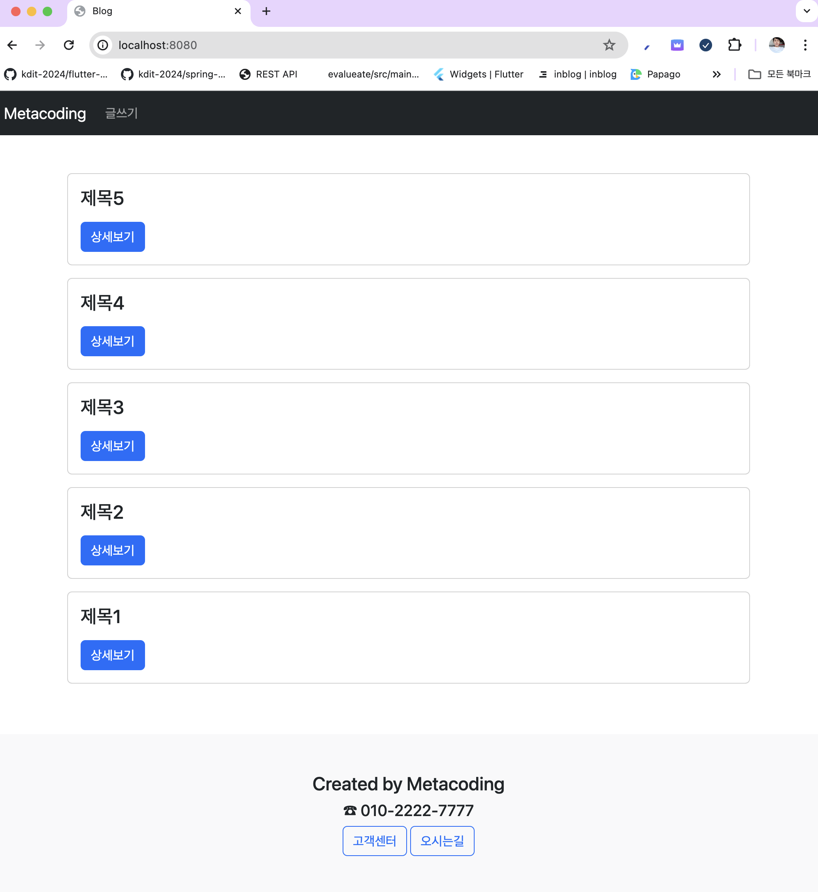

# 혼자 만들면서 배우는 스프링부트 

## Chapter 01 익명블로그 만들기
```text
https://github.com/hanbit-book/spring-blog-v1-end.git
```



### 1. 학습 순서
- 더미데이터 생성
- 글목록보기
- 글상세보기
- 글쓰기
- 글삭제하기
- 글수정하기

### 2. 테스트 순서
- 글목록보기 1
- 글상세보기 2
- 글쓰기 3
- 글삭제하기 4
- 글수정하기 5

### 3. 기술스택
- Springboot 3.2
- JDK 21
- IntelliJ or STS or VSCode
- H2 (인메모리 테스트 데이터베이스 : 개발 용도로 사용)
- MySQL8.0 (진짜 데이테베이스 : 서비스 용도로 사용)

### 4. 의존성
- Lombok
- DevTools
- Spring WEB
- JPA
- h2
- MySQL
- Mustache